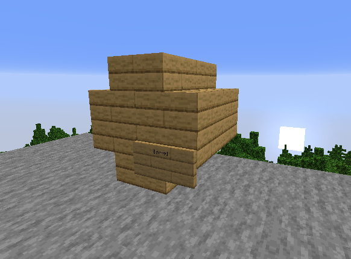
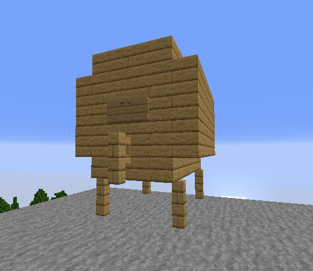

### Brewery
- To nie jest standardowe warzenie mikstur. Brewery skupia się całkowicie na alkoholu i dążeniu do jego przyjemności. Dodając kilka niestandardowych mikstur i mechanikę upicia, zawsze gwarantuje świetną zabawę.
- Opanuj sztukę warzenia poprzez fermentację, destylację i dojrzewanie w beczkach różnorodnych mikstur. Doświadcz, jak z prostych składników, dzięki ciężkiej pracy i wytrwałości, powstaje pyszne piwo. Destyluj mocne trunki, które zyskują wyjątkowy smak po kilku latach dojrzewania w drewnianych beczkach. Świętuj największe uczty, jakie sobie wyobrazić możesz, i zawsze utrzymuj radosną atmosferę. Wypełniaj tawerny śmiechem i głośną muzyką, podczas gdy pijani szaleją na ulicach.

### Opis 
- Warz napoje alkoholowe, które faktycznie mogą sprawić, że się upijesz.
- Napoje o niższej jakości będą miały wady, takie jak kac.
- Proces warzenia obejmuje różne kroki, takie jak fermentacja, destylacja i dojrzewanie.
- Udoskonalaj jakość, aż napoje staną się doskonałe.
- Opanuj warzenie nawet najbardziej trudnych napojów.
- Stwórz własne receptury, obejmujące składniki, właściwości i proces tworzenia.

### Proces 
- Nadszedł czas na warzenie. W przeciwieństwie do standardowego Minecrafta, nie jest to takie proste, jak dodanie składnika do kociołka i czekanie, aż proces się zakończy. W zależności od receptury, proces może być trudny i czasochłonny. Niektóre przepisy wymagają precyzji zarówno w zakresie składników, jak i czasu. Jeśli nie będziesz ostrożny, partia może mieć niezamierzone skutki uboczne lub w ogóle się zepsuć.

### Warzenie / Fermentowanie 
## Pierwszym krokiem jest gotowanie składników.
1. Umieść kociołek nad ogniem.
2. Napełnij go wodą.
3. Użyj składników na kotle, aby je dodać.
4. Czekaj, podczas gdy się gotują, sprawdzając czas zegarem.
5. Napełnij butelki szklane z kociołka po zakończeniu procesu gotowania.

### Destylacja 
- Umieść pył Glowstone w górnym slocie kociołka do warzenia jako filtr. (Nie zostanie zużyty.)
- Load your filled bottles into the brewing stand

### Dojrzewanie 
- Do dojrzewania napojów niezbędne są drewniane beczki. Posiadają one miejsce na składowanie napojów podczas procesu starzenia. Istnieją dwie różne wielkości beczek, a większość receptur wymaga określonego rodzaju drewna.
## Mała Beczka 
1. 8 Drewnianych Schodków 
2. 1 Tabliczka

- Zbuduj kształt beczki za pomocą schodków. Następnie umieść znak na przedniej dolnej prawej stronie, wpisując "Barrel" na górnej linii. Otrzymasz potwierdzenie: "Stworzono beczkę".
## Duża Beczka
1. 18 Drewnianych Desek
2. 16 Drewnianych Schodków 
3. 5 Drewnianych Płotków
4. 1 Tabliczka 

