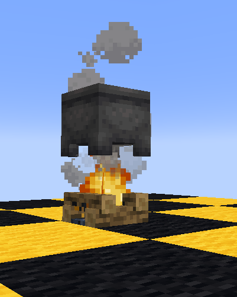
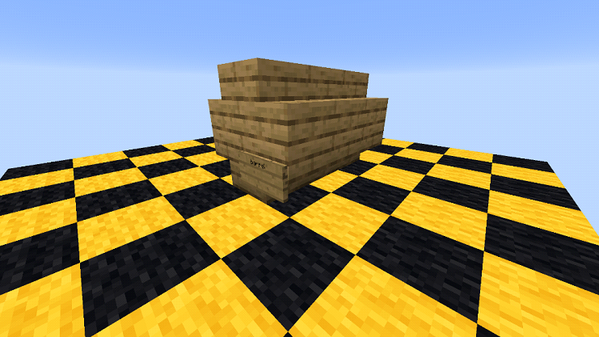
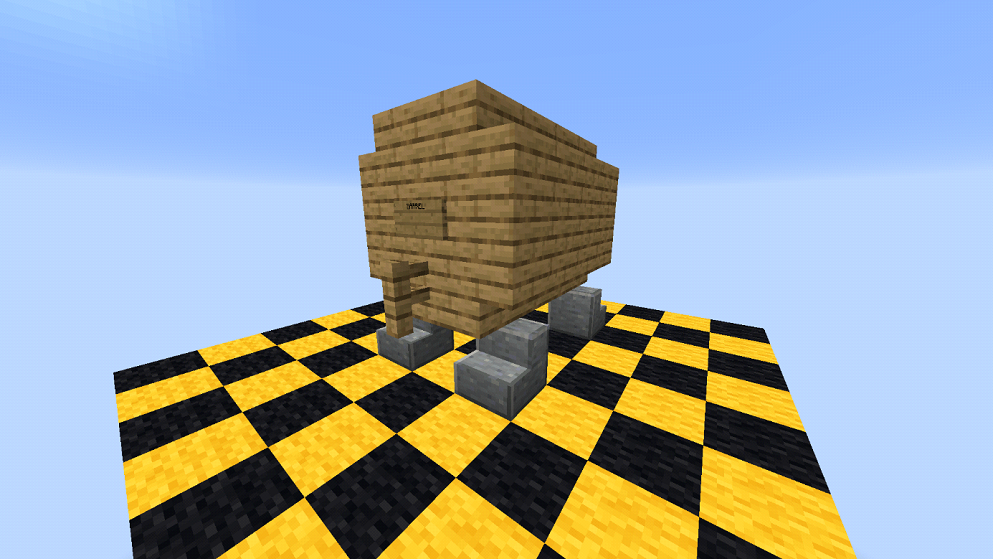

# Brewery
**Berwery** to plugin dodający alkohole, pijanstwo i zabawę! Dzięki niemu urozmaicisz wszystkie nudne obrady i sprawisz, że życie nabierze kolorów. Na tej edycji alkohole będą miały charakter __jedynie__ rozrywkowy, tzn. po wypiciu np. rumu nie otrzymasz efektu odporności na ogień a jedynie poziom upicia.

# Poziom upicia
Po wypiciu dostatecznej ilości alkoholu będziesz: chodził samoczynnie na boki, pisał bzdury na chacie lub wymiotował! 

# Proces tworzenia alkoholu
Jeśli chciałbyś/ałabyś rozpocząć swoją przygodę z niesamowitą z produkcją piwa, wina itd., służę z pomocą!
## Fermentacja:
Aby wytworzyć alkohol musimy zacząć od sfermentowania składników, w tym celu musisz:
1. Zbudować specjalny kociołek, postaw kocioł nad rozpalonym ogniskiem (zdj. 1)
2. Napełnić wyżej wymieniony kocioł wodą.
3. Kliknąć (PPM) wybranymi składnikami na kociołek. (raz włożonego składnika nie da się później wyciągnąć)
4. Odczekaj jakiś czas. (możesz sprawdzić ile wywar się gotuje za pomocą zegara)
5. Wyjmij napój z kotła przy pomocy szklanych butelek.

## Destylacja:
Destylacja to proces który nie jest wymagany przy wszystkich alkoholach. Ale przy niektórych jest on bardzo ważny, aby destylować należy umieścić butelki z wywarem w dolnych slotach Brewing stand'u (Stołu alchemicznego) a jako składniku użyć Glowdust'u (Jasnopył)
## Dojrzewanie
Ostatnim etapem naszej przygody jest dojrzewanie, to tu alkohol nabiera smaku i koloru. Do tego będziesz potrzebował/a beczki, zrobisz ją z drewna i tabliczki, są dwa rodzaje beczek; duża i mała.
### Mała beczka 
Mała beczka posiada 9 miejsc na alkohol i do jej zbudowania potrzeba: 12 drewnianych schodów (tego samego rodzaju) i jednej tabliczki z napisem "barrel" (zdj. 2)

### Duża beczka
Duża beczka ma 27 miejsc na alkohol a zawiera ona 16 drewnianych schodów (tego samego rodzaju), 18 bloków drewnianych desek (także tego samego rodzaju), jeden drewniany płotek i jedną tabliczkę z napisem "barrel" (zdj. 3)

## Proces: 
Włóż butelkę z wywarem do beczki z danego rodzaju drewna (wielkość beczki nie ma znaczenia) i po odczekaniu wyznaczonej ilości "lat" (jeden rok to jeden dzień minecraftowy (20 minut)) wyjmij swój alkohol z beczki 