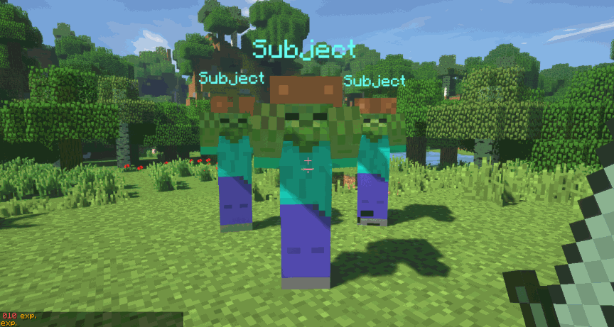
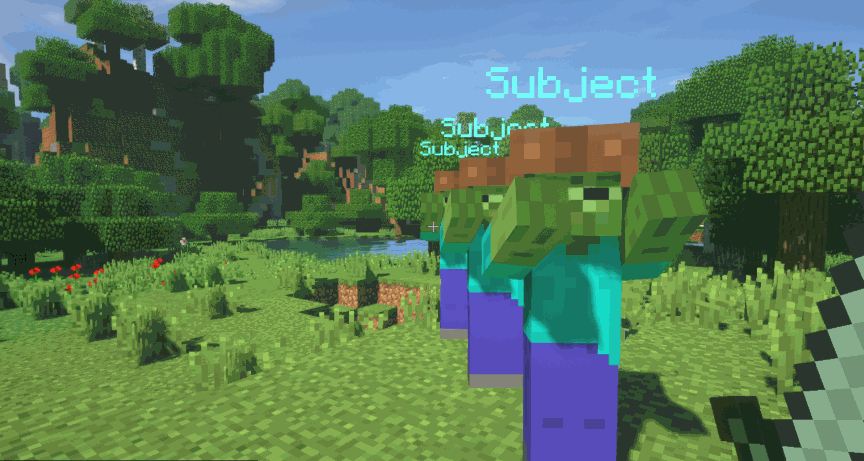

Na serwerze znajduje się w sumie 80 tarcz, 50 hełmów, ok. 50 różnorodnych broni oraz wiele zbroi.
### Rzadkości Broni i Zbroi
Zbroje i Bronie dzielą się na 5 kategorii takich jak:
- Zwyczajne
- Rzadkie
- Epickie 
- Legendarne 
- Mityczne
### Typy broni
Bronie dzielą się na następujące typy:
- Obuchowe (Np. Maczugi)
- Cięte (Zakrzywione miecze, miecze dwuręczne) 
- Przebijające (Piki, włócznie, lance)
### Typy obrażeń

Obuchowe zadają obrażenia obszarowe wookół celu.

Cięte zadają obrażenia w stożku.

Przebijające zadają obrażenia za celem.

### Crafting
Aby wytworzyć bronie i zbroje musisz znaleść sklep gdzie są sprzedawane odpowiednie stacje, musisz je postawić na ziemi i kliknąć na nie PPM aby otworzyć gui craftingu.

### Bronie rzucane 
Na serwerze znajdują się bronie rzucane np. oszczep, aby rzucać należy kilknąć PPM trzymając przedmiot w ręce.

credit: mvndicraft
