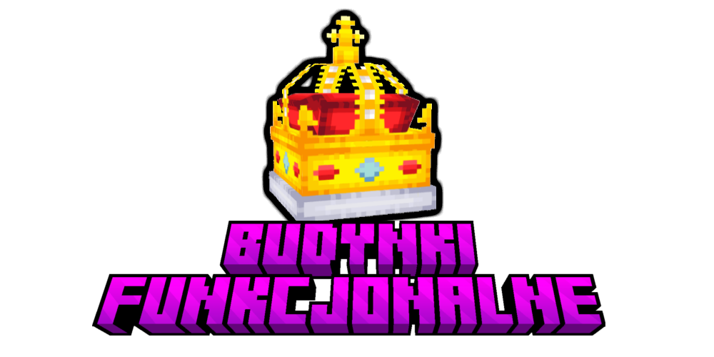

Jak dobrze wiecie, edycja odbywa się w czasach Drugiej Wojny Światowej, w związku z tym narzucony będzie styl budowania z jej z okresu gdy ta trwała. Żadne kary za niewłaściwy styl budynku typu ban lub zniszczenie budowli nie będą stosowane przez administrację, jednak budynki nie wpasowujące się w czasy w których się znajdują nie będą brane pod uwagę jeżeli mają one być budynkami funkcjonalnymi (czyli budynek nie zostanie przydzielony).

By urozmaicić chęć budowania, dodano **budynki funkcjonalne**! Wyróżniamy: miasto port oraz szyb naftowy. Na czym one polegają?

:::caution Uwaga!
Aby zgłosić swój budynek funkcjonalny przejdź do kanału **#budynki-funkcjonalne** na naszym serwerze Discord!
:::

## Tiery Miast
Jeżeli zbudujesz ładne drugowojenne budynki w prowincji, otrzymasz bardzo fajne i korzystne bonusy na terenie miasta! W zależności od jakości i wyglądu budynku, twoja prowincja dostanie bonus w zależności od **tieru miasta**.

:::info Informacja
Budynki funkcjonalne podlegają ocenie administracji - dokładniej osobom z rangą Moderator i wyżej, zatem trzeba się postarać aby zdobyć wysokie bonusy do surowców. Wszystkie tiery mają dane (poziomy), wyższe tiery są trudniejsze do zdobycia, jednak zapewniaja dużo większe bonusy. Jako administracja nie spodziewamy się wielu Metropolii, jednak liczymy na waszą kreatywność!
:::

### Tier 1
- +50% Boost do przychodu z prowincji

### Tier 2
- +150% Boost do przychodu z prowincji
- +30% Boost do dropu z kamienia na danej prowincji

### Tier 3
- +300% Boost do przychodu z prowincji
- +75% Boost do dropu z kamienia na danej prowincji

### Metropolia (Tier 4)
- +500% Boost do przychodu z prowincji
- +150% Boost do dropu z kamienia na danej prowincji

:::info Informacja
Pierwszy tier miasta wymaga budynków o łącznej powierzchni około 200 kratek, drugi tier wymaga już 500 kratek powierzchni. Miasta otrzymują tier trzeci, jeżeli są stosunkowo większe od miasta tieru drugiego oraz jeżeli zaskoczyły administrację jakimiś charakterystycznymi budowlami. Miasto czwartego tieru, tuteż Metropolia, wymaga zbudowanego na conajmniej trzeci tier miasta oraz monumentalnej budowli albo naprawdę ogrmonej powierzchni.
:::

## Porty
Port jest jedynym sposobem na szybką podróż po gigantycznej mapie naszego serwera. Porty pogrupowane są na poszczególne grupy portów, szybka podróż możliwa jest jedynie do portów z tej samej grupy. Na naszym serwerze wyróżniamy takie grupy portów jak: Ocean Atlantycki, Morze Bałtyckie, Morze Śródziemne, Morze Czarne, Ocean Indyjski, Ocean Spokojny, Ocean Arktyczny, Morze Kaspijskie.
Porty budowane być mogą jedynie w prowincjach mających dostęp do morza lub oceanu. 
Porty, tak jak inne budynki funkcjonalne budowane być muszą w stylu odpowiadającym danej edycji trwającej na serwerze.

:::info Informacja
Domyślnie szybka podróż w porcie jest darmowa i odbywa się poprzez użycie komendy **/port warp `nazwa_portu`**.
:::

## Szyb Naftowy
Szyby naftowe to budynki które zwiększają zyski ropy z prowincji na której jest ropa i zarazem tylko na takich mogą być budowane.

- Każdy szyb naftowy przynosi zysk 2 jednostek ropy.

## Huta
Huta to budynek służący przetapianiu niektórych metali dostępnych na serwerze, można z niej korzystać tylko na prowincji na której ta się znajduje!

- Huta pozwala na tworzenie Stali oraz Aluminium.

## Tkalnia
Tkalnia, miejsce w którym tworzy się tkaniny potrzebne do mundurów i ubrań cywilnych, dają one jakąkolwiek ochronę stąd są tak ważne, a korzystać z nich można tlyko na prowincjach na których się znajdują.

- Tkalnia pozwala na tworzenie Tkanin.

## Rafineria Gumy
Rafineria ta pozwala na tworzenie gumy z kauczuku oraz jej syntetycznych odpowiedników z ropy. Korzystać z niej można tylko na prowincji na której się znajduje.

- Rafineria Gumy umożliwia tworzenie Gumy z kauczuku lub ropy.

## Fabryka Materiałów Budowlanych
W tej fabryce odbywa się tworzenie wszelkich niestandardowych jak na minecraft bloków nadających immersji drugowojennej rozgrywce. Korzystać z niej można tylko na prowincji na której się znajduje. 

### W Fbryce Materiałów Budowlanych można tworzyć:

- Marmur - 2 diorytu, 2 bruku tworzy 4 Bloki Marmuru
- Wapń - 2 piasku, 2 bruku tworzy 4 Bloki Wapnia
- Asfalt - 4 ropy, 4 żwiru tworzy 8 Bloków Asfaltu
- Marmurowe Cegły - 4 marmuru tworzy 4 Bloki Marmurowych Cegieł
- Azbest - 4 granitu, 2 krzemu, 2 boxytu tworzy 8 Bloów Azbestu
- Eternit - 5 azbestu, 2 piasku, 2 żwiru tworzy 8 Bloków Eternitu

## Młyn Kulkowy
Młyn Kulkowy, niewielu osobom znana rzecz aczkolwiek praktyczna, za jego pomocą można odzyskać trochę surowców kosztem mało przydatnych i często zalegających blokach kamieniopodobnych. Korzystać można tylko na prowincji na której się znajduje.

- Młyn Kulkowy przerabia stack (64) graniutu/andezytu/żwiru,diorytu na 1 sztukę żelaza, wolframu, chromu oraz boxytu

## Rafineria Ropy
W budynku zwanym Rafinerią Ropy można zarówno otrzymywać paliwo z ropy jak i samą syntetyczną ropę jeżeli zwykłej brak. Korzystać z niej można tylko na prowincji na której się znajduje.

- Rafineria Ropy umożliwia tworzenie Paliwa z ropy oraz ropy z węgla