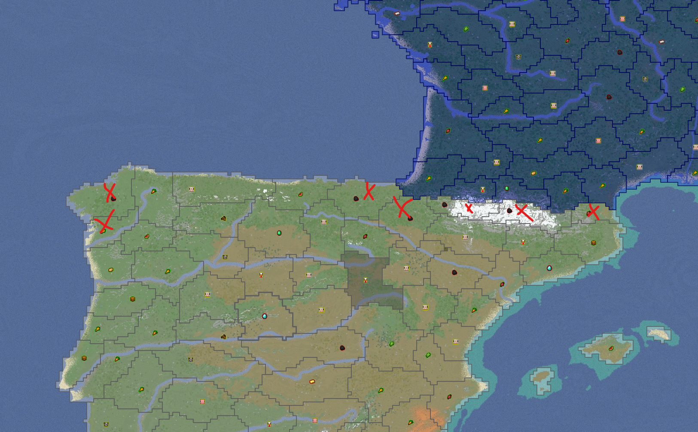

### Jak zawiązać/rozwiązać Sojusze?
- Użyj **/sojusz `nazwa_miasta/nazwa_panstwa`** aby wysłać, bądź zaakceptować ofertę **sojuszu**.
- Miasta lub państwa w sojuszu nie mogą sobie wypowiadać wojen.
- Wypowiedzenie wojny innemu państwu/miastu spoza sojuszu **nie** oznacza wciągnięcia sojuszników do wojny!
- Użyj **/rozwiazsojusz `nazwa_miasta/nazwa_panstwa`** aby rozwiązać sojusz z danym państwem/miastem.

:::info Informacja
Miasta mogą tworzyć sojusze bez państwa. Kiedy miasto dołącza do państwa, wszystkie poprzednie sojusze się usuwają. Kiedy miasto wychodzi z państwa, jego sojusze też zostają usunięte. Kiedy państwo zostanie usunięte, wszystkie sojusze miast się usuwają.
:::

# Zgłoszenie Wojny
Termin na zgłoszenie wojny to minimum jeden dzień przed dniem gdy jest planowana wojna. Aby zgłosić wojnę, musisz utworzyć zgłoszenie według poniższego formatu: 
- Nick: 
- Zaangażowane państwa: 
- Sojusznicy: 
- Cele wojenne:

:::caution Uwaga!
Podczas zgłaszania wojen, zachowaj rozwagę, aby było to sensowne i **realistyczne**. Przykładowo Hiszpania na początku serwera nie może zadeklarować wojny przeciwko Moskwie ze względu na odległość.
:::

# Okresy Wojny
 a) W piątek jest jeden Okres Wojenny od 17:00 do 22:00. Priorytet w przypadku piątkowych okresów wojennych będzie udzielany mniejszym wojnom z udziałem mniejszych państw i/lub wielu grup.
 b) W soboty będą 2 Okresy Wojenne. Pierwszy trwa od 11:00 do 14:00, a drugi od 17:00 do 22:00 . Priorytet w przypadku sobotnich okresów wojennych będzie udzielany większym wojnom z udziałem głównych państw i/lub wielu grup.
 c) W niedziele będą 2 okresy wojenne trwające od 11:00 do 14:00 i od 17:00 do 22:00. Ten okres wojenny będzie przeznaczony dla wojen, które nie mogły być stoczone w soboty.

# Sojusze i Udział w Wojnach
Każde państwo może być obecne podczas dwóch okresów wojennych, z wyjątkiem Piątkowych Wojen. Wszystkie państwa mogą być zaangażowane w dwie wojny: jedną jako główny agresor (napastnik lub obrońca) i jedną jako sojuszniczy uczestnik wojny. Przy wezwaniu sojuszników, zachowaj umiar. Jeśli Anglia walczy z Francją, Anglia nie może wezwać Moskwy do pomocy ze względu na odległość. (Inne tego typu przypadki mogą być rozstrzygnięte indywidualnie)
- Grupy najemników mogą uczestniczyć w dodatkowym okresie wojennym, sprawdź zasady najemników w celu uzyskania więcej informacji.
- Wszystkie państwa mogą mieć maksymalnie 4 sojuszników.

# Cele Wojenne
Po opublikowaniu rozpiski wojen na weekend, uczestnicy wojny (Napastnicy i Obrońcy) mają czas do piątku na opublikowanie mapy swoich celów wojennych na prowincje w zgłoszeniu. 

## Zasady dotyczące celów wojennych: 
a) Wszystkie uzyskane obszary muszą sąsiadować z państwem wypowiadającym wojnę. Oznacza to, że muszą graniczyć z nimi lub być połączone z uzyskiwaną prowincją. 
b) Obszary przybrzeżne nie podlegają powyższej zasadzie. Atakowanie prowincji przybrzeżnych jest możliwe tylko jeśli państwo atakujące ma wybrzeże w tej samej grupie portów co prowincja przybrzeżna, który jest atakowana. 
c) Liczba uzyskiwanych obszarów będzie zależała od wielkości państwa. Państwa posiadające 30+ obszarów może utracić do połowy swoich obszarów w wyniku wojny. Państwa posiadające od 10 do 29 obszarów mogą stracić do jednej trzeciej swoich obszarów w wyniku wojny. Państwa posiadające od 5 do 9 obszarów mogą stracić wszystkie obszary poza swoją stolicą w wyniku wojny. Państwa posiadające od 1 do 4 obszarów mogą stracić wszystkie swoje obszary w wyniku wojny, oznacza to że stolic nie można uzyskać, chyba że państwo ma mniej niż 5 obszarów.

Cele wojenne są publikowane zbiorczo przez sojuszników. Powyższe zasady nie odnoszą się do każdego członka wojny w sposób szczegółowy.

## "Wojna Śmierci"
Jeśli obie strony się zgodzą, powyższe zasady dotyczące celów wojennych mogą być zawieszone, aby umożliwić "Wojnę Śmierci", w której stawka to wszystkie obszary głównego atakującego i broniącego w wojnie.

Przykład celów wojennych Włoch przeciwko Francji:

# Zasady Najemników
Grupy najemników są tworzone na życzenie gracza w zgłoszeniach, z zatwierdzeniem ich liderów narodowych. Oczekuje się, że najemnicy wysłuchają ofert obu stron i nie będą używani jako ogólny pretekst do PVP dla zabawy. Konieczny będzie dowód zakupu. Płatność może być dokonywana w zasobach lub obszarach, jeśli ma to sens. Najemnicy nie mają prawa do stawiania celów wojennych. Grupy najemników są ograniczone do maksymalnie 10 członków. Zasada stanowi, że każda strona wojny ma prawo wynająć jedną grupę najemników. W przypadku bardzo dużych wojen, z udziałem wielu narodów, możemy znieść limit grup najemników po każdej stronie.

:::info Informacja
Grupę najemników (osoby które zamierzają dołączyć do wojny) należy podać w tickecie na dc
:::

# Bunt
Jeśli miasto zostało zdobyte, ma opcję buntu przez 2 okresy wojenne po swoim podbiciu. Podczas buntu miasto nie zostanie pozbawione większości swoich obszarów, które są pod kontrolą ich zwierzchnika, zachowując tylko te wokół swojej stolicy (maksymalnie 5 obszarów, decyzja indywidualna). Bunt podlega tym samym zasadom, co deklaracje wojenne pod względem terminów. Buntujące się narody mogą mieć tylko jednego sojusznika, który wspiera ich niepodległość bezpośrednio poprzez wojnę.

### Atakowanie prowincji
Aby zaatakować prowincje stawiamy dowolny **płotek** na chunku (płotek ma imitować "flagę"). 
- Atakowany chunk musi graniczyć z twoją prowincją, bądź z innym przejętym chunkiem.
	- Pierwsze chunki zajmowane w danym państwie nie muszą graniczyć z twoim terytorium.
- Możliwe jest atakowanie trzech różnych chunków w tym samym czasie.
- "Flaga" musi widzieć niebo, nie może być postawiona pod ziemią lub pod wodą.
- Zniszcz wełnę lub płotek by przerwać atak przeciwnika (po postawieniu **płotka**, plugin automatycznie kładzie na niego wełnę).
- Jeżeli "flaga" nie zostanie znisczona, po upływie 2 minut zajmiesz chunk'a. Możesz obudować "flagę", jednak nie możesz postawić bloku w obrębie jednej kratki od "flagi".
- Zajmij Home chunk (**H** na /miasto minimapa lub /miasto mapa) aby zająć całą prowincję, tym samym ją okupując. Pamiętaj jednak, że zajmowanie Home chunka trwa prawie cztery minut!

    

:::tip Porada
Warto użyć minimapy **/miasto minimapa**, by widzieć na jakim chunku się znajdujesz oraz jakie chunk/chunki możesz zaatakować.
:::

### Okupacja prowincji
- Każda prowincja ma swój **home chunk** oznaczona literą "H" na /miasto minimapa lub /miasto mapa.
- Po przejęciu home chunk'a, cała prowincja jest **okupowana** przez atakujące miasto.
- Okupant prowincji dostaje **podatki** od przegranego miasta.

:::info Informacja
Podatki to część przychodu: wykopanych rud, wydobytych plonów lub rozmnożonych zwierząt w prowincji, wszystko to idzie do okupanta. Podatki są depozytowane do skrzynki **/miasto przychod**. Podatki wynoszą 40% podstawowego zysku prowincji.
:::
:::caution Uwaga!
Okupowane prowincje nie są częścią miasta okupanta. Na okupowanych prowincjach obie strony mogą niszczyć i stawiać bloki lub otwierać skrzynki.
:::

### Aneksja
Aneksja jest mocno zalecana.
- Miasto okupujące prowincję może ją zaanektować poprzez komendę **/miasto aneksja**, jednak może to zrobić jedynie w czasie wojny.
- Anektowanie dodaje prowincje do twojego miasta, jako normalną zajętą prowincje.
- Anektowane terytorium nie kosztuje powera.

Anektowana prowincja działa jak każda inna zajęta prowincja przez twoje miasto, tzn. możesz na niej budować, używać skrzynek, itd...

### Konflikty Graniczne
- Państwa mogą atakować tylko prowincje graniczące.
- Jeżeli stolica okaże się graniczącą prowincją, ta nie może zostać przejęta.
- Kiedy zajmiesz prowincję otrzymujesz ją na 24 godziny, potem jest zwracana do właściciela.
- **Konflikty Graniczne** będą włączone dla każdego.
- **Konflikty Graniczne** mogą być okazją do tworzenia celu wojennego (Casus Belli).

### Traktaty pokojowe
- Wpisz **/pokoj `nazwa_miasta/nazwa_panstwa`** aby negocjować **traktat pokojowy**, otwiera to GUI traktatu pokojowego.
- Traktat pokojowy może być negocjowany w każdym czasie, nawet przed wojną, lub po jej zakończeniu. W ramach komendy **/pokoj `nazwa_miasta/nazwa_panstwa`** możesz np. sprzedawać prowincje innym graczom.
- Po podpisanym traktacie pokojowym, miasta wchodzą w okres rozejmu na 48h.
	- Państwa w rozejmie nie mogą wypowiadać sobie wojen.
	- Wpisz **/rozejm** aby zobaczyć trwające rozejmy z innymi miastami.

::caution Uwaga!
Menu traktatów pokojowych nie akceptuje niestandardowych przedmiotów, zatem płacone dukaty muszą zostać przekazane poprzez wyrzucenie lub poprzez komendę **/trade**.
::

	

