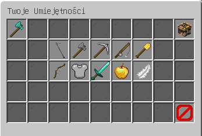

### Ogólne poziomy 
Na serwerze znajdziecie wiele kategorii, które możecie ulepszać poprzez wykonywanie różnych czynności. Każda kategoria dodaje zwiększa odpowiednie statystyki:
- Rolnictwo - zwiększa zdrowie i siłę,
- Leśnictwo - zwiększa siłę i twardość,
- Górnictwo - zwiększa twardość i szczęście,
- Wędkarstwo - zwiększa szczęście i zdrowie,
- Wydobywanie - zwiększa regeneracje i szczęście,
- Łucznictwo - zwiększa szczęście i siłę,
- Obrona - zwiększa twardość i zdrowie,
- Walka - zwiększa siłę i regeneracje,
- Wytrzymałość - zwiększa regeneracje i twardość,
- Zręczność - zwiększa mądrość i regeneracje.

# 