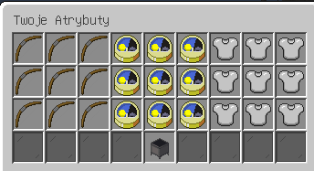
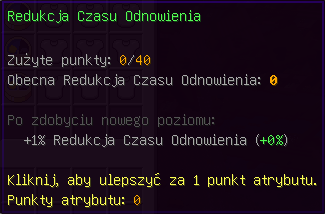

## Jak Działają Atrybuty?

### Jak ulepszać Atrybuty?
- Po zdobyciu każdego poziomu postaci otrzymujesz 1 punkt do użycia pod komendą /atrybuty.
# 
### Co zmieniają Atrybuty?
Po rozdaniu punktu atrybutów otrzymujesz permamentną z 3 statystyk które wpływają na twoją rozgrywkę.
- Łócznictwo
	- Atrybut Łócznictwa permamentnie nadaje obrażenia z łuku/kuszy. 
	# 
- Redukcja Czasu Odnowienia
	- Atrybut Redukcji Czasu Odnowienia permamentnie nadaje skrócony czas odnowienia umiejentości.
	# 
- Przyśpieszenie