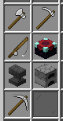
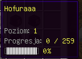

# Profesje
# 
## Jak Działają Profesje?
- Pofesje to specjalizacje w danej dziedzinie odblokowywujące benefity dla niej.
### Jak ulepszać Profesje?
- Profesje ulepsza się wykonując akcje związane z profesją (np:Rolnictwo = Zbieranie Upraw etc...).

# Poziom Ogólny
# 
## Jak Działa Poziom Ogólny?
- Poziom Ogólny to twój wyznacznik zaawansowania na serwerze, co poziom dostajesz punkty i ulepszenia do statystyk.
### Jak zdobywać Poziom Ogólny?
- Jest jeden sposób na zdobywanie progresji Poziomu Ogólnego jest to zabijanie stworów i potwrów na całej mapie.

